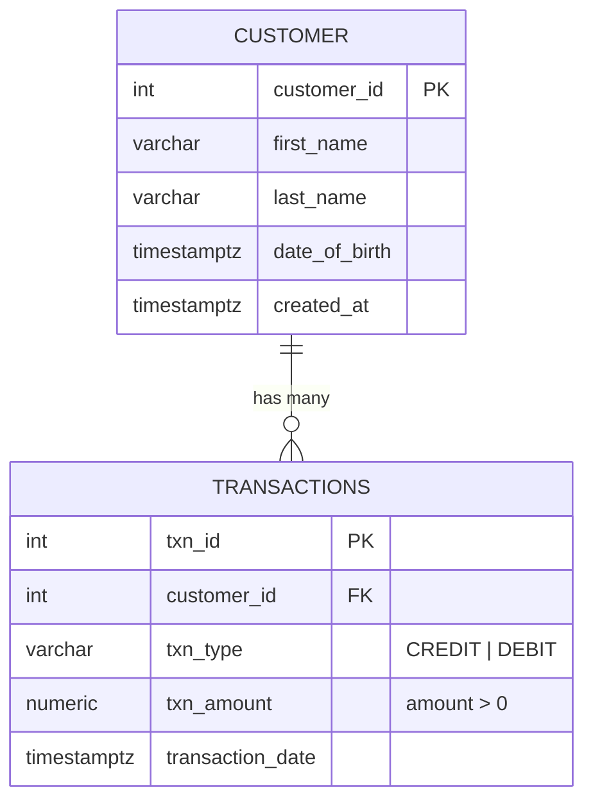

# Relational Database Deep Dive: PostgreSQL & Money Club Solution

This module provides a production-grade demonstration of **Relational Database Management Systems (RDBMS)** using **PostgreSQL**, focusing on ACID transactions, schema design, constraints, window functions, and query optimization.

---

## 1. Relational Database Core Concepts

### ACID Guarantees
- **Atomicity**: All statements within a transaction (`BEGIN ... COMMIT`) succeed together, or everything rolls back on failure (`ROLLBACK`).
- **Consistency**: Database invariants (Foreign Keys, `NOT NULL`, `CHECK` constraints) are strictly enforced at all times.
- **Isolation**: Concurrent transactions execute without dirty reads or unrepeatable reads (configurable from `READ COMMITTED` up to `SERIALIZABLE`).
- **Durability**: Committed data is written to Write-Ahead Logging (WAL) and persists even across server power outages.

### Schema Design & Entity Relationship


---

## 2. Solved Assessment: Money Club Average Savings

### The Problem
Given a date, retrieve all transactions that occurred on that date, compute each transacting customer's net savings (`Credit - Debit`), group customers by rounded age, and compute the **average savings per customer** within each age bracket.

### Critical Bugs Fixed from Legacy Code
1. **Customer vs. Transaction Averaging**: The original solution divided total savings by total transaction count. If 1 customer made 10 small transactions, that customer was weighted 10x higher. The fixed solution computes customer net savings first, then averages across distinct customers.
2. **Timestamp Truncation**: Replaced exact timestamp matching (`WHERE transaction_date = %s`) with date truncation (`WHERE transaction_date::date = %s`), capturing all transactions regardless of hour/minute.
3. **Age Precision & Rounding**: Calculated fractional years and rounded to nearest integer instead of using integer floor division (`// 365`).
4. **Timezone Awareness**: Handled `TIMESTAMPTZ` and ISO string parsing without throwing `TypeError: can't subtract offset-naive and offset-aware datetimes`.
5. **Format Support**: Supports both candidate test specification format (`"date": "dd/mm/yyyy"`) and fallback ISO format (`"YYYY-MM-DD"`).

### Client-Side vs. Database-Side Architecture

| Feature | Client-Side Aggregation (`calculate_savings`) | PostgreSQL-Side Aggregation (`calculate_savings_sql_optimized`) |
| :--- | :--- | :--- |
| **Network Transfer** | Transfers all rows for that date over wire | Transfers only aggregated age summary rows (few bytes) |
| **Memory Footprint** | Python builds in-memory dictionaries | PostgreSQL engine optimizes in work_mem |
| **Performance** | O(N) Python iteration + serialization | Uses index scans, parallel workers, and hardware vectorization |

---

## 3. Directory Structure

```
01-relational-postgres/
├── README.md               # This guide
├── requirements.txt        # Python dependencies (psycopg2-binary, pytest)
├── docker/
│   └── init.sql            # Table DDL, constraints, indexes & seeds
├── docs/
│   └── python-candidate-test.pdf # Original assessment specification
├── src/
│   ├── money_club_sol.py   # Fixed & optimized solution
│   └── queries.py          # ACID, Window Functions & EXPLAIN ANALYZE
└── tests/
    └── test_money_club.py  # Unit tests (runs with pytest or unittest)
```

---

## 4. How to Run & Verify

### Running Unit Tests (Zero External Dependencies)
```bash
PYTHONPATH=01-relational-postgres python3 -m unittest discover -s 01-relational-postgres/tests
```

### Running with Dockerized PostgreSQL
```bash
# 1. Start Postgres database
docker compose up -d postgres

# 2. Execute the solution against live DB
PYTHONPATH=01-relational-postgres python3 01-relational-postgres/src/money_club_sol.py
```
