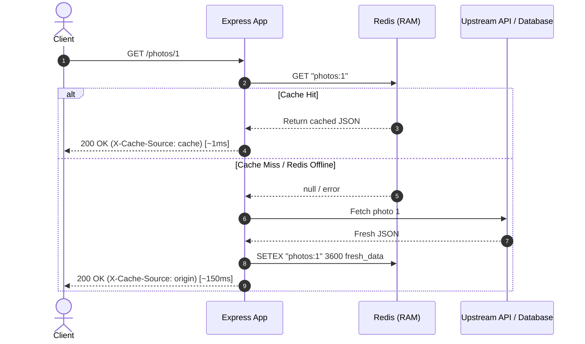

# In-Memory Database & Caching Deep Dive: Redis

This module explores **In-Memory Data Stores** through **Redis**, focusing on caching design patterns, data structures beyond simple key-value, sliding-window rate limiting, and performance benchmarking.

---

## 1. Why In-Memory? (RAM vs Disk I/O)

Traditional relational databases persist data to disk (SSD/NVMe). While performant, disk access incurs seek/transfer overhead (microseconds to milliseconds). Redis stores all primary data structures directly in RAM:

| Storage Type | Medium | Typical Read Latency | Throughput (Single Node) |
| :--- | :--- | :--- | :--- |
| **PostgreSQL (Disk)** | NVMe SSD | 1 - 10 ms | ~5,000 - 20,000 QPS |
| **Redis (In-Memory)** | System RAM | 0.05 - 1 ms | ~100,000+ QPS |

---

## 2. Core Caching Patterns

### Cache-Aside Pattern (Lazy Loading)
Implemented in [cacheManager.js](file:///home/liberprimus/code/database_projects/02-cache-redis/src/cacheManager.js):



### Eviction Policies & Memory Limits
When Redis reaches its maximum memory limit (`maxmemory`), it applies configured eviction algorithms:
- `allkeys-lru`: Evicts least recently used keys across all keys (best for general caching).
- `volatile-lru`: Evicts least recently used keys that have an explicit TTL (`EXPIRE`).
- `volatile-ttl`: Evicts keys with shortest time to live.
- `noeviction`: Returns errors when memory is full (standard for message queues / critical state).

---

## 3. Redis Data Structures Beyond Strings

Demonstrated in [dataStructuresDemo.js](file:///home/liberprimus/code/database_projects/02-cache-redis/src/dataStructuresDemo.js):

| Structure | Common Commands | Ideal Use Case |
| :--- | :--- | :--- |
| **Strings** | `SET`, `GET`, `INCR` | Page caching, session tokens, atomic view counters |
| **Hashes** | `HSET`, `HGETALL`, `HINCRBY` | User profiles, cart items, configuration dictionaries |
| **Lists** | `LPUSH`, `RPOP`, `LRANGE` | Task queues, event timelines, activity feeds |
| **Sets** | `SADD`, `SINTER`, `SMEMBERS` | Unique tags, friend connections, access control lists |
| **Sorted Sets (ZSET)** | `ZADD`, `ZRANGE`, `ZCARD` | Real-time gaming leaderboards, sliding-window rate limiters |
| **Bitmaps** | `SETBIT`, `BITCOUNT` | Extreme-efficiency Daily Active Users (DAU) analytics |

---

## 4. Sliding-Window Rate Limiting

Implemented in [rateLimiter.js](file:///home/liberprimus/code/database_projects/02-cache-redis/src/rateLimiter.js) using Redis Sorted Sets:
1. When a request arrives from IP $X$, removes timestamps older than the sliding window (`now - 60s`).
2. Counts remaining elements in the set using `ZCARD`.
3. If count exceeds threshold (e.g., 60 req/min), responds with `HTTP 429 Too Many Requests`.
4. Otherwise, records current timestamp and permits request.

---

## 5. How to Run & Benchmark

### 1. Start Redis Service
```bash
docker compose up -d redis
```

### 2. Run the Cached Express Server
```bash
cd 02-cache-redis
npm install
npm start
```

### 3. Run Data Structures Interactive Demo
```bash
npm run demo:structures
```

### 4. Execute Latency Benchmark
```bash
npm run benchmark
```
*Expected output: Direct API ~150-300 ms vs Cache Hit ~1-3 ms (50x - 100x latency reduction).*
