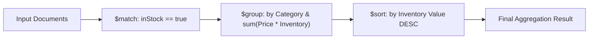

# Document Database Deep Dive: MongoDB

This module explores **Document Stores (NoSQL)** using **MongoDB**, focusing on polymorphic schemas, embedding vs. referencing, multikey indexing, and multi-stage aggregation pipelines.

---

## 1. Relational vs. Document Store Comparison

| Dimension | Relational (PostgreSQL) | Document Store (MongoDB) |
| :--- | :--- | :--- |
| **Data Model** | Flat tables, rows, strict schemas, foreign keys | Hierarchical BSON documents, dynamic schemas |
| **Handling Varying Attributes** | Requires EAV (Entity-Attribute-Value) anti-pattern or JSONB columns | Native nested objects (`attributes: { screenSize, ramGb }`) |
| **Relationships** | Normalized tables joined at query time via `JOIN` | Denormalized (Embedded) or Referenced (`$lookup`) |
| **Scaling Strategy** | Strong vertical scaling, read-replicas | Native horizontal sharding (distributed partitioned clusters) |
| **Consistency** | Strict ACID transactions by default | Tunable consistency (`w: majority`, `readConcern: linearizable`) |

---

## 2. Polymorphic Product Catalog

In an e-commerce catalog, different categories possess completely different attributes:
- **Electronics**: `screenSize`, `ramGb`, `storageGb`, `processor`, `batteryLifeHours`
- **Apparel**: `sizes`, `colors`, `material`, `care`
- **Books**: `isbn`, `author`, `publisher`, `pageCount`

In SQL, this often leads to bloated sparse tables (hundreds of null columns) or complex EAV join tables. In MongoDB, each document encapsulates its own schema while remaining fully indexable:

```json
{
  "_id": "prod_101",
  "name": "UltraBook Pro 16",
  "category": "Electronics",
  "price": 1499.99,
  "attributes": {
    "screenSize": "16 inch",
    "ramGb": 32,
    "processor": "M3 Pro"
  }
}
```

---

## 3. MongoDB Aggregation Pipeline

Rather than issuing multiple queries and joining data in application code, MongoDB's **Aggregation Pipeline** pipes documents through successive transform stages:



Demonstrated in [aggregation_demo.py](file:///home/liberprimus/code/database_projects/03-document-mongodb/src/aggregation_demo.py).

---

## 4. How to Run

### Run Without External Dependencies (In-Memory Simulation)
```bash
python3 03-document-mongodb/src/catalog_service.py
python3 03-document-mongodb/src/aggregation_demo.py
```

### Run Unit Tests
```bash
PYTHONPATH=03-document-mongodb python3 -m unittest discover -s 03-document-mongodb/tests
```

### Run Against Live MongoDB Container
```bash
docker compose up -d mongo
MONGO_URI="mongodb://localhost:27017" python3 03-document-mongodb/src/catalog_service.py
```
