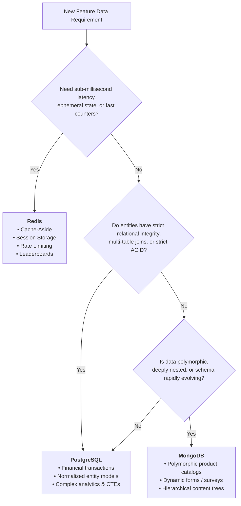

# Database Mastery: Multi-Paradigm Engineering Showcase

[](LICENSE)
[](01-relational-postgres/)
[](02-cache-redis/)
[](03-document-mongodb/)
[](docker-compose.yml)

A production-grade, architectural showcase and hands-on laboratory designed to explore, contrast, and master the three dominant modern database paradigms:
1. **Relational / SQL (PostgreSQL)**: ACID transactions, relational normalization, CTEs, Window Functions, and query execution plans.
2. **In-Memory & Caching (Redis)**: Cache-Aside pattern, sliding-window rate limiters, memory eviction policies, and advanced data structures (Hashes, Sorted Sets, Bitmaps).
3. **Document Store / NoSQL (MongoDB)**: Polymorphic schema design, nested attribute indexing, and multi-stage aggregation pipelines.

---

## 1. Database Paradigms Comparison Matrix

| Attribute | Relational (PostgreSQL) | In-Memory (Redis) | Document Store (MongoDB) |
| :--- | :--- | :--- | :--- |
| **Data Paradigm** | Relational / Tables / Rows | In-Memory Key-Value / Data Structures | Document / Hierarchical BSON |
| **Primary Use Cases** | Financial ledgers, complex business entities, ACID transactions | High-frequency caching, rate limiting, leaderboards, session store | E-commerce catalogs, CMS, user-generated content, event logging |
| **CAP Theorem Positioning** | **CP** (Consistency & Partition Tolerance) | **CP** / In-Memory (Configurable persistence) | **CP** (Tunable read/write concerns) |
| **Consistency Model** | Strict ACID (Immediate consistency) | Immediate on Primary (Asynchronous replica replication) | Tunable (`w: majority`, linearizable reads) |
| **Storage Medium** | Disk (NVMe / SSD) with RAM buffer pool | RAM (In-Memory) with optional AOF/RDB snapshots | Disk with WiredTiger RAM cache |
| **Typical Read Latency** | 1 ms - 15 ms | **0.1 ms - 1 ms** (Sub-millisecond) | 2 ms - 20 ms |
| **Query Mechanism** | Declarative SQL, Joins, Window Functions | Command-based API (`GET`, `ZADD`, `HSET`) | MQL (MongoDB Query Language), Aggregation Pipeline |
| **Schema Enforcement** | Strict compile-time DDL validation | Schema-less (Key / Data structure convention) | Dynamic / Schema-on-read with optional JSON Schema |
| **Scaling Strategy** | Strong vertical scaling, Read Replicas | In-Memory clustering, Sentinel high availability | Horizontal Sharding (Native cluster partitioning) |

---

## 2. Architectural Decision Flowchart

When choosing the database layer for a feature, use the following decision framework:



---

## 3. Repository Architecture

```
database_projects/
├── docker-compose.yml               # Unified multi-database environment (Postgres, Redis, Mongo, Adminer)
├── .env.example                     # Preconfigured local environment variables
├── .gitignore                       # Clean Git configuration (no committed node_modules or dumps)
├── Makefile                         # Unified commands (make up, make test, make seed)
│
├── 01-relational-postgres/          # RELATIONAL PARADIGM
│   ├── README.md                    # ACID, normalization, indexing, and execution planning
│   ├── docker/init.sql              # Schema DDL, constraints, indexes & seeds
│   ├── docs/python-candidate-test.pdf # Original Money Club test assessment
│   ├── src/
│   │   ├── money_club_sol.py        # Fixed, accurate candidate test solution
│   │   └── queries.py               # ACID transfers, Window Functions & EXPLAIN ANALYZE
│   ├── tests/
│   │   └── test_money_club.py       # Unit tests verifying averaging math & date parsing
│   └── requirements.txt             # Valid dependencies (psycopg2-binary, pytest)
│
├── 02-cache-redis/                  # IN-MEMORY & CACHING PARADIGM
│   ├── README.md                    # In-memory mechanics, eviction policies (LRU), Cache-Aside
│   ├── package.json                 # Express, Redis v4, Axios
│   ├── src/
│   │   ├── server.js                # Baseline uncached Express server
│   │   ├── server_redis.js          # Resilient cached server with Redis v4
│   │   ├── cacheManager.js          # Cache-Aside pattern with transparent fallback
│   │   ├── rateLimiter.js           # Sliding-window rate limiter using Sorted Sets (ZSET)
│   │   └── dataStructuresDemo.js    # Strings, Hashes, Lists, Sets, ZSets, Bitmaps
│   ├── benchmark/
│   │   └── benchmark.js             # Latency benchmark (Direct API vs Redis Cache Hit)
│   └── tests/
│       └── server.test.js           # Zero-dependency caching and fallback test suite
│
└── 03-document-mongodb/             # DOCUMENT STORE PARADIGM
    ├── README.md                    # Document modeling, embedding vs referencing
    ├── seed/products.json           # Polymorphic e-commerce product catalog
    ├── src/
    │   ├── catalog_service.py       # Nested queries, array tags, and polymorphic attributes
    │   └── aggregation_demo.py      # Multi-stage Aggregation Pipeline ($match, $unwind, $group)
    └── tests/
        └── test_catalog.py          # Unit tests for document store service
```

---

## 4. Key Solutions & Engineering Highlights

### 4.1 PostgreSQL: Money Club Average Savings Fix
- **The Defect**: The legacy implementation divided total savings by the count of transactions, incorrectly weighting high-frequency transactors over normal customers.
- **The Fix**: In [money_club_sol.py](file:///home/liberprimus/code/database_projects/01-relational-postgres/src/money_club_sol.py), net savings (`credit - debit`) are aggregated per unique customer first, mapped to rounded ages, and averaged strictly across the count of distinct customers.
- **Timestamp Truncation**: Replaced rigid `WHERE transaction_date = %s` with date casting `WHERE transaction_date::date = %s` to ensure transactions throughout the day are matched.
- **SQL-Side Execution**: Added an alternative CTE implementation (`calculate_savings_sql_optimized`) that eliminates client-side memory overhead by processing the entire aggregation inside PostgreSQL.

### 4.2 Redis: Modern SDK & Fault-Tolerant Cache-Aside
- **The Defect**: Legacy server code attempted to use deprecated callback syntax with `redis@4` and failed to connect the client, while broken string quotes collapsed dynamic cache keys into static literals (`'photos:${req.params.id}'`).
- **The Fix**: In [server_redis.js](file:///home/liberprimus/code/database_projects/02-cache-redis/src/server_redis.js) and [cacheManager.js](file:///home/liberprimus/code/database_projects/02-cache-redis/src/cacheManager.js):
  - Migrated to native async/await `redis@4` connection lifecycle.
  - Implemented backtick template literals for unique cache keys and upstream endpoints.
  - Implemented **Graceful Degradation**: If Redis is offline or crashes, the application catches the error and serves the request directly from the origin API without failing the user request.
  - Implemented **Sliding-Window Rate Limiter** via Redis Sorted Sets (`ZSET`).

### 4.3 MongoDB: Polymorphic Catalog & Aggregation
- **Polymorphic Schemas**: Demonstrated how varying product categories (Electronics, Apparel, Books) coexist within a single collection without the schema rigidity of SQL.
- **Aggregation Pipelines**: Demonstrated multi-stage data computation (`$match` -> `$unwind` -> `$group` -> `$sort`) for computing category inventory valuations and tag popularity matrices.

---

## 5. Quickstart Guide

### Prerequisites
- Docker & Docker Compose
- Python 3.9+
- Node.js 18+

### 1. Launch All Databases
```bash
# Boot PostgreSQL, Redis, MongoDB, and Adminer
make up
```

Web Admin Interfaces:
- **Adminer (Database GUI)**: [http://localhost:8080](http://localhost:8080) (System: PostgreSQL, Server: `postgres`, User: `postgres`, Password: `postgres`)

### 2. Run Test Suites
```bash
make test
```
*Executes unit tests across PostgreSQL and MongoDB modules.*

### 3. Run Redis Caching & Benchmark
```bash
cd 02-cache-redis
npm install

# Start the cached server
npm start

# In a separate terminal, run the latency benchmark
npm run benchmark
```

### 4. Run MongoDB Catalog & Aggregation Demos
```bash
python3 03-document-mongodb/src/catalog_service.py
python3 03-document-mongodb/src/aggregation_demo.py
```

### 5. Tear Down
```bash
make down
```

---

## 6. License
This repository is licensed under the [MIT License](LICENSE).